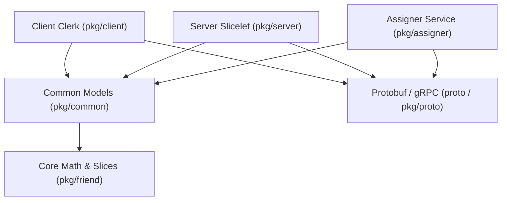

# GoDicer

A high-fidelity Go port of **Databricks Dicer**, a distributed consistent sharding, automatic load-balancing, and partition-slicing framework.

---

## Architecture & Package Roadmap

The project is structured into modular components, preserving 100% logic and test parity with the original Databricks Scala codebase:



### Packages & Modules

- **Core Geometry & Partitions ([`pkg/friend`](file:///Users/quangh/Desktop/llm/dicer/godicer/pkg/friend/README.md))**:
  - `SliceKey`: 8-byte prefix accelerated string keys.
  - `Slice`: Half-open key range `[Low..High)`.
  - `SliceMap`: O(log N) binary search lookup and complete slice invariant verification.
  - `Squid`: Slicelet Incarnation UniQUe ID for pod tracking.

- **Cluster Models & Wire Formats ([`pkg/common`](file:///Users/quangh/Desktop/llm/dicer/godicer/pkg/common/README.md))**:
  - `Generation`: 128-bit monotonically increasing cluster generation (`Incarnation` + `Number`).
  - `Assignment`: Immutable cluster partition map binding slices to worker pod resources.
  - `AtomicAssignmentCell`: Lock-free atomic pointer storage with monotonic CAS updates.
  - `ProtoConverter`: Efficient domain <-> Protobuf translation with index pool deduplication.

- **Smart Client ([`pkg/client`](file:///Users/quangh/Desktop/llm/dicer/godicer/pkg/client/README.md))**:
  - `AssignmentSyncStateMachine`: Pure, deterministic synchronization state machine.
  - `SliceLookup`: Active background driver with 20ms tick and gRPC Watch loop.
  - `SliceLookupCache`: Process-wide connection and Watch stream deduplication.
  - `ResourceRouter`: Sub-microsecond O(log N) routing, round-robin, two-level sharding, and retry failover.
  - `Clerk`: Unified developer facade.

- **Server Worker Runtime ([`pkg/server`](file:///Users/quangh/Desktop/llm/dicer/godicer/pkg/server))**:
  - `EWMACounter`: Half-life exponentially weighted moving average load metrics.
  - `SliceletLoadAccumulator`: Per-slicelet QPS tracking, top hot key identification, and unattributed load measurement.
  - `Slicelet`: Server worker runtime managing local slice ownership and key validation.
  - `MeshFallback`: Mesh proxying for misdirected requests during online cluster migrations.

- **Assigner & Load-Balancing Algorithm (`pkg/assigner/algorithm`)**:
  - *Upcoming Phase 5*: Splitter, Merger, and LoadMap algorithms for dynamic load redistribution.

---

## Testing

Run all unit and integration tests across the entire repository with the Go race detector enabled:

```bash
go test -v -race ./...
```