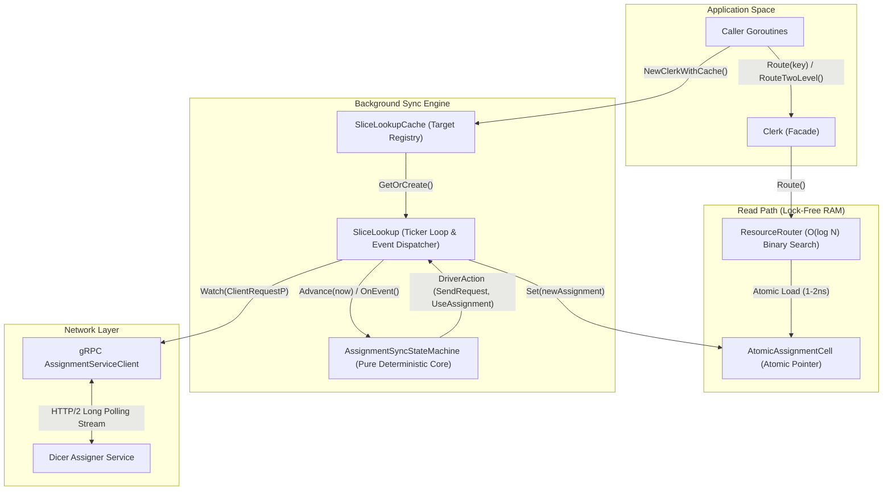
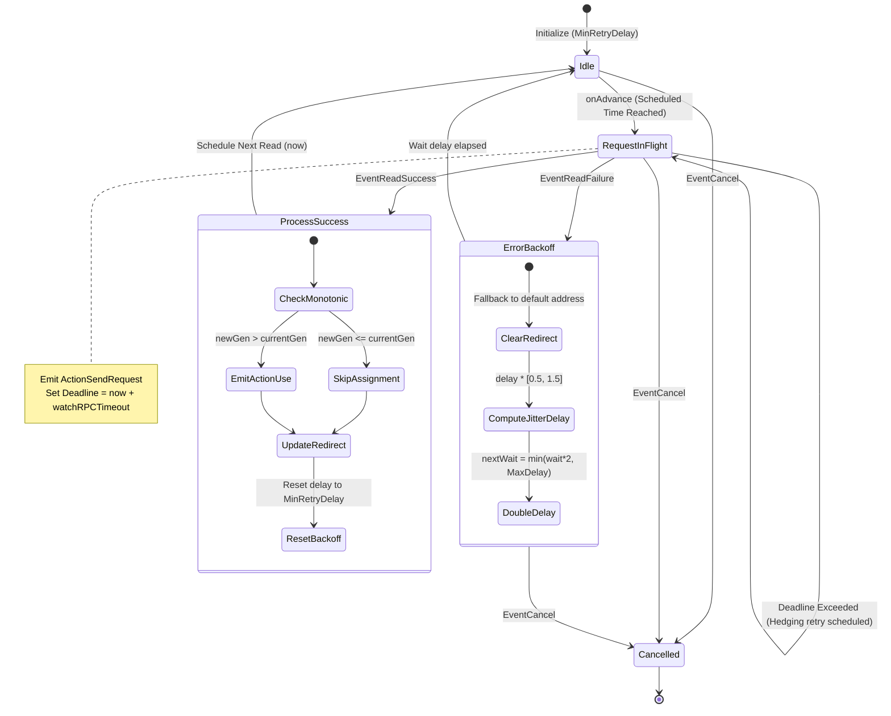
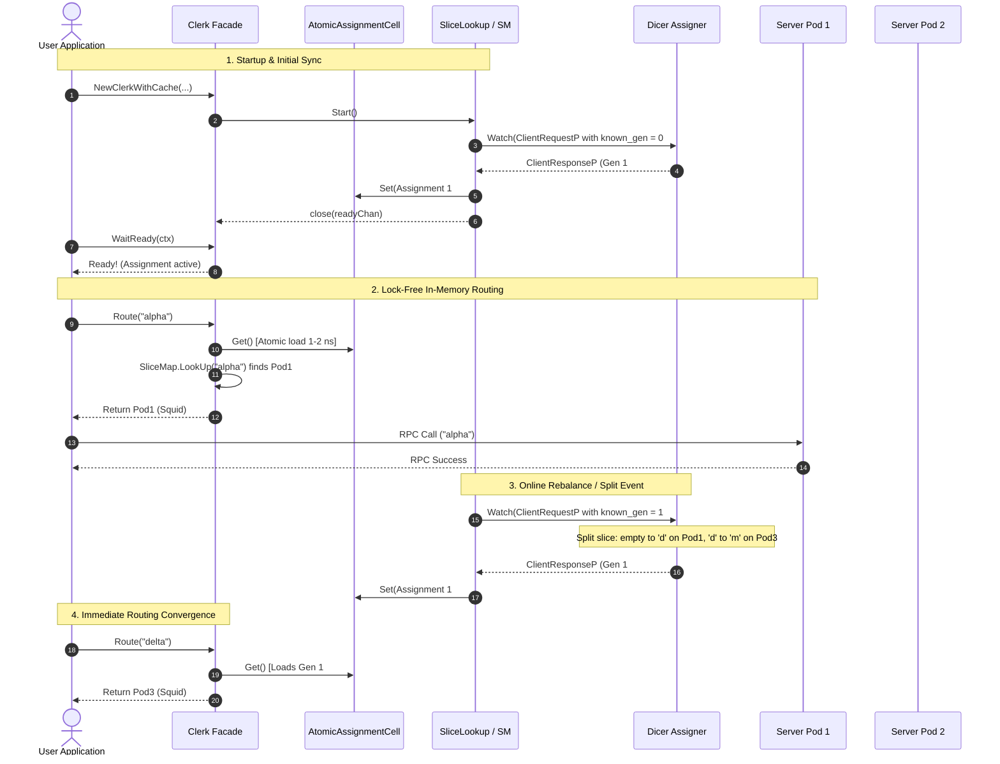

# Dicer Smart Client (`pkg/client`)

The `client` package provides a high-performance, lock-free client library for applications querying services sharded by Dicer. It enables client applications to resolve partition keys to server pod incarnations (`Squid`) with sub-microsecond in-memory lookups, while continuously synchronizing partition assignments from the Dicer Assigner via gRPC.

---

## Table of Contents

1. [Architecture Overview](#1-architecture-overview)
2. [Component Details](#2-component-details)
   - [AssignmentSyncStateMachine (State Machine)](#21-assignmentsyncstatemachine-state_machinego)
   - [SliceLookup (Background Driver)](#22-slicelookup-slice_lookupgo)
   - [SliceLookupCache (Connection Pool)](#23-slicelookupcache-lookup_cachego)
   - [ResourceRouter (Routing Engine)](#24-resourcerouter-routergo)
   - [Clerk (Public Facade)](#25-clerk-clerkgo)
3. [State Machine Lifecycle & Transitions](#3-state-machine-lifecycle--transitions)
4. [Protocol & Communication Sequence](#4-protocol--communication-sequence)
5. [Feature Parity with Scala Dicer](#5-feature-parity-with-scala-dicer)
6. [Complete Usage Example](#6-complete-usage-example)

---

## 1. Architecture Overview

The client package enforces a strict separation between **pure, deterministic state machine logic**, **asynchronous I/O background polling**, **multi-tenant connection caching**, and **lock-free, sub-microsecond in-memory key routing**:



### Key Design Principles:
1. **Zero Contention Read Path**: Callers executing `Route(key)` load an immutable snapshot from `AtomicAssignmentCell` via atomic pointer load (1-2 nanoseconds), with no mutex locks on the hot path.
2. **Pure Functional State Machine**: All network policy decisions (timeouts, retries, jittered backoff, generation monotonicity, redirects) reside in `AssignmentSyncStateMachine`, which has zero I/O dependencies and is 100% deterministically unit-testable.
3. **Automatic Deduplication**: When multiple services or handlers within the same process connect to the same sharded target, `SliceLookupCache` pools the underlying gRPC watch streams.

---

## 2. Component Details

### 2.1. `AssignmentSyncStateMachine` (`state_machine.go`)

Directly ported from Scala's `com.databricks.dicer.client.AssignmentSyncStateMachine`. It manages synchronization state without performing network operations directly.

#### Input Events
- `EventReadSuccess`: Received when a Watch RPC succeeds with a `ClientResponseP`.
- `EventReadFailure`: Received when a Watch RPC fails due to network drop, deadline exceeded, or gRPC error.
- `EventCancel`: Signals graceful shutdown; transitions the state machine to an inert state.

#### Emitted Actions
- `ActionUseAssignment`: Emitted when an assignment strictly newer than the currently active generation has been received and verified.
- `ActionSendRequest`: Instructs the background driver to dispatch a new Watch RPC with specified timeout, redirect token, and synchronization payload.

#### Algorithms & Policies
- **Monotonic Generation Check**:
  Ensures that cluster assignments never move backwards due to out-of-order responses:
  ```go
  if sm.assignment == nil || newAssignment.Generation.Compare(sm.assignment.Generation) > 0 {
      sm.assignment = newAssignment
      // emit ActionUseAssignment
  }
  ```
- **Hedging & Dynamic Deadlines**:
  Tracks in-flight RPCs against `watchRPCTimeout` (default 30s or server suggested timeout). If an RPC exceeds its deadline, the state machine triggers a hedge retry without blocking.
- **Jittered Exponential Backoff**:
  To prevent thundering herds when the Assigner restarts or networks partition, consecutive failures double the delay from `MinRetryDelay` (50ms) up to `MaxRetryDelay` (2s), multiplied by a random factor in `[0.5, 1.5]`:
  `delay = currentWait * (0.5 + rand[0, 1])`
- **Server Lag Recovery**:
  If the remote server reports an older generation than what the client currently holds, the client switches `SyncAssignmentStateP` from `KnownGeneration` to `KnownAssignment`, feeding the latest assignment back to help the lagging server recover.
- **Redirects & Token Echoing**:
  If a response contains a `RedirectP`, future requests are routed to `Redirect.Address` with `redirect_token` echoed back. If the redirect endpoint fails, the client clears the redirect and falls back to `DefaultWatchAddress`.

---

### 2.2. `SliceLookup` (`slice_lookup.go`)

Directly ported from Scala's `com.databricks.dicer.client.SliceLookup`. It serves as the active execution driver for the state machine.

- **Ticker Loop**: Executes an internal 20ms tick calling `sm.OnAdvance(now)` to evaluate deadlines, scheduled retries, and time progression.
- **Asynchronous RPC Dispatch**: Spawns non-blocking goroutines for `ActionSendRequest`, executing `AssignmentService.Watch` and returning `EventReadSuccess` or `EventReadFailure` back to the state machine.
- **Readiness Barrier**:
  Exposes `Ready() <-chan struct{}` and `WaitReady(ctx context.Context) error` (equivalent to Scala's `Clerk.ready: Future[Unit]`). Allows applications to pause startup until the cluster layout is populated.

---

### 2.3. `SliceLookupCache` (`lookup_cache.go`)

Directly ported from Scala's `com.databricks.dicer.client.SliceLookupCache`.

- **Deduplication Key**: Keys cached `SliceLookup` instances by `target|defaultWatchAddress`.
- **Resource Conservation**: Multiple `Clerk` instances pointing to the same service reuse a single underlying connection, avoiding duplicate HTTP/2 streams and Assigner overhead.
- **Lifecycle Management**: `Close()` stops all active background goroutines and clears the registry.

---

### 2.4. `ResourceRouter` (`router.go`)

Directly ported from Scala's `com.databricks.dicer.client.ResourceRouter`. It translates partition keys to target pod addresses (`Squid`).

- **Lock-Free Read**: Atomically loads `Assignment` snapshot from `AtomicAssignmentCell` in 1-2 ns.
- **O(log N) Binary Search**: Delegates to `friend.SliceMap.LookUp(sliceKey)` to find the slice range containing the key.
- **Round-Robin Replica Balancing (`Route`)**:
  When a slice has multiple healthy replicas (`Squid`), an atomic uint64 counter distributes requests evenly across them.
- **Two-Level Sharding (`RouteTwoLevel`)**:
  Matches Scala's `getStubForKey(primaryKey, secondaryKey)`. Uses `primaryKey` to locate the slice partition, and hashes `secondaryKey` (using FNV-1a 64-bit) across the slice's replica set. Useful for session affinity or secondary indexing.
- **Retry-Aware Failover (`RouteWithRetry`)**:
  Matches Scala's `getNextStubForKey(key, tried)`. Accepts a slice of already-contacted replicas that failed; filters them out and returns the next untried replica.

---

### 2.5. `Clerk` (`clerk.go`)

The primary application-facing API. It wraps `SliceLookup` and `ResourceRouter` into a convenient, thread-safe client interface.

| Method | Description |
| :--- | :--- |
| `NewClerk(...)` | Constructs an independent `Clerk` instance with its own background sync loop. |
| `NewClerkWithCache(...)` | Constructs a `Clerk` sharing a pooled `SliceLookup` via `SliceLookupCache`. |
| `WaitReady(ctx)` | Blocks until initial cluster assignment has been received or context cancelled. |
| `Route(key)` | Resolves a key to a single replica pod `Squid` via O(log N) lookup and round-robin. |
| `RouteAll(key)` | Returns all assigned replica `Squid`s for the partition slice. |
| `RouteTwoLevel(pKey, sKey)` | Hashes secondary key across replicas of the partition selected by primary key. |
| `RouteWithRetry(key, tried)` | Picks the next available untried replica when previous calls have failed. |
| `Assignment()` | Returns an immutable point-in-time snapshot of the current `Assignment`. |
| `Close()` | Stops the background worker and frees resources. |

---

## 3. State Machine Lifecycle & Transitions

The following state diagram details the internal lifecycle of `AssignmentSyncStateMachine`:



---

## 4. Protocol & Communication Sequence

The diagram below shows the complete lifecycle: client startup, readiness signal, sub-microsecond routing, and dynamic online rebalancing:



---

## 5. Feature Parity with Scala Dicer

The table below lists the original Databricks Scala components and their exact Go counterparts:

| Scala Dicer (`dicer/client/src/...`) | Go Dicer (`godicer/pkg/client/...`) | Status | Notes |
| :--- | :--- | :--- | :--- |
| `AssignmentSyncStateMachine.scala` | `state_machine.go` | Completed | Pure state machine, identical backoff, hedging, redirects |
| `SliceLookup.scala` | `slice_lookup.go` | Completed | 20ms tick loop, readiness channel, gRPC watch driver |
| `SliceLookupCache.scala` | `lookup_cache.go` | Completed | Target-pooled registry, safe concurrent access |
| `ResourceRouter.scala` | `router.go` | Completed | O(log N) lookup, round-robin, two-level sharding, retry failover |
| `Clerk.scala` & `ClerkImpl.scala` | `clerk.go` | Completed | Public API facade with context-aware helpers |

---

## 6. Complete Usage Example

```go
package main

import (
	"context"
	"fmt"
	"time"

	"github.com/quangh33/godicer/pkg/client"
	"github.com/quangh33/godicer/pkg/friend"
)

func main() {
	// 1. Configure state machine timing and Assigner address
	cfg := client.DefaultStateMachineConfig()
	cfg.DefaultWatchAddress = "assigner.prod.internal:50051"
	cfg.WatchRPCTimeout = 15 * time.Second

	// 2. Initialize shared connection pool
	cache := client.NewSliceLookupCache()
	defer cache.Close()

	// 3. Create Clerk for the sharded service target
	clerk := client.NewClerkWithCache(cache, "user-storage-service", "frontend-node-01", cfg)
	defer clerk.Close()

	// 4. Block until the initial cluster assignment is received
	ctx, cancel := context.WithTimeout(context.Background(), 10*time.Second)
	defer cancel()

	if err := clerk.WaitReady(ctx); err != nil {
		panic(fmt.Sprintf("Failed waiting for initial Dicer assignment: %v", err))
	}
	fmt.Println("Clerk successfully synced initial cluster layout!")

	// 5. Standard sub-microsecond key routing
	key := "user_record_98412"
	pod, err := clerk.Route(key)
	if err != nil {
		panic(err)
	}
	fmt.Printf("Key %q mapped to Pod: %s (Address: %s)\n",
		key, pod.String(), pod.ResourceAddress)

	// 6. Two-level sharding (primary slice + deterministic secondary replica affinity)
	sessionPod, err := clerk.RouteTwoLevel(key, "session_token_abc123")
	if err != nil {
		panic(err)
	}
	fmt.Printf("Two-level affinity pod: %s\n", sessionPod.ResourceAddress)

	// 7. Retry-aware failover routing
	// If pod fails to respond, query for next untried replica
	triedPods := []friend.Squid{pod}
	fallbackPod, err := clerk.RouteWithRetry(key, triedPods)
	if err != nil {
		fmt.Printf("No alternative replicas available for key: %v\n", err)
	} else {
		fmt.Printf("Failover to untried replica: %s\n", fallbackPod.ResourceAddress)
	}
}
```

---

## Testing & Verification

Run tests with the Go race detector enabled:

```bash
cd /Users/quangh/Desktop/llm/dicer/godicer
go test -v -race ./pkg/client/...
```
