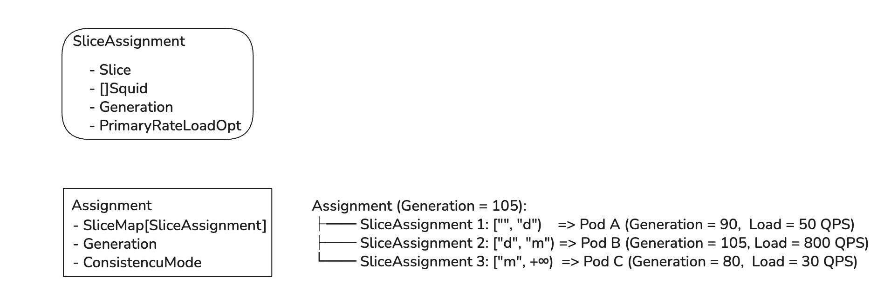

# Dicer Common Package (`pkg/common`)

The `common` package provides the core domain models, invariant validation, lock-free memory storage, and serialization logic for Dicer cluster state, partition assignments, and versioning.

---

## Table of Contents

1. [Version Management: `Incarnation` and `Generation`](#1-version-management-incarnation-and-generation)
2. [Subslice Tracking: `SubsliceAnnotation` and `Transfer`](#2-subslice-tracking-subsliceannotation-and-transfer)
3. [Partition Models: `SliceWithResources` and `SliceAssignment`](#3-partition-models-slicewithresources-and-sliceassignment)
4. [Global Cluster Map: `Assignment`](#4-global-cluster-map-assignment)
5. [Lock-Free Concurrency: `AtomicAssignmentCell`](#5-lock-free-concurrency-atomicassignmentcell)
6. [Protobuf Wire Protocol: `proto_converter.go`](#6-protobuf-wire-protocol-proto_convertergo)

---

## 1. Version Management: `Incarnation` and `Generation`

Located in `generation.go`, these entities establish a 128-bit monotonically increasing version identifier that prevents version rollback and split-brain states across cluster lifecycles.

### `Incarnation`
- **Definition**: Represents the upper 64 bits of a version.
- **Purpose**: Tracks major storage or cluster lifecycle changes (such as etcd migrations or disaster recoveries). While ordinary sequence numbers might reset to 0 after an infrastructure rebuild, bumping the `Incarnation` guarantees that old clients and servers immediately reject stale metadata from previous cluster lifecycles.
- **Guardrail**: Enforces an upper bound guardrail (values must not exceed `5 << 48`) to protect against accidental arithmetic overflow.

### `Generation`
- **Definition**: A composite 128-bit struct:
  - `Incarnation Incarnation`: Upper 64 bits (cluster epoch).
  - `Number uint64`: Lower 64 bits representing Unix millisecond timestamp or incremental sequence counter.
- **Ordering**: Compared lexicographically (Incarnation first, then Number).
- **Invariants**: Empty sentinel `EmptyGeneration` (incarnation 0, number 0) denotes uninitialized state. Any valid cluster assignment must carry a non-empty generation.

---

## 2. Subslice Tracking: `SubsliceAnnotation` and `Transfer`

Located in `subslice_annotation.go`, these entities solve the cache invalidation problem when partitions are split or merged.

### The Problem
When high load causes Dicer to split slice `["a" .. "z")` into `["a" .. "m")` and `["m" .. "z")`, both child slices receive a brand new `Generation`. Without additional context, a worker node handling `["a" .. "m")` would believe it received a totally new slice and discard its in-memory cache, causing severe cache cold starts.

### `SubsliceAnnotation`
- **Definition**: An annotation attached to a slice assignment recording a sub-range that has remained continuously assigned to a specific worker.
- **Fields**:
  - `Subslice friend.Slice`: The continuous sub-range.
  - `ContinuousGenerationNumber uint64`: The earliest generation number from which continuous assignment began without interruption.
  - `StateTransfer *Transfer`: Optional pointer to the state source.
- **Benefit**: Allows the worker to verify continuous ownership, preserving hot cache in RAM and maintaining data consistency guarantees.

### `Transfer`
- **Definition**: Metadata indicating that data for a migrating partition should be fetched from another server pod incarnation.
- **Fields**:
  - `FromResource friend.Squid`: The source server pod incarnation that held the partition before the migration.

---

## 3. Partition Models: `SliceWithResources` and `SliceAssignment`

Located in `assignment.go`, these structs model individual slice allocations and strictly enforce all mathematical invariants.

### `SliceWithResources`
- **Definition**: Pairs a `friend.Slice` with its assigned replica set (`[]friend.Squid`).
- **Invariants**: The assigned resources list must be non-empty (at least one active worker replica must be assigned).

### `SliceAssignment`
- **Definition**: The complete allocation specification for a single slice partition.
- **Fields**:
  - `SliceWithResources`: The target slice and assigned workers.
  - `Generation`: Slice-level generation tracking when this slice was last altered.
  - `SubsliceAnnotationsByResource`: Map from `friend.Squid` to an ordered, disjoint list of subslice annotations.
  - `PrimaryRateLoadOpt`: Optional measured throughput (QPS) observed on this slice.
- **Strict Invariants Enforced on Construction**:
  1. All annotated subslices must fit strictly inside the parent slice: `subslice.Low >= slice.Low` and `subslice.High <= slice.High`.
  2. For any given resource, subslice annotations must be mutually disjoint and ordered ascending.
  3. Continuous generation numbers on subslices must not exceed the slice generation: `ContinuousGenerationNumber <= Generation.Number`.
  4. The slice generation must share the exact same `Incarnation` as the containing `Assignment`.
  5. Slice generation must not exceed the parent assignment generation: `Slice.Generation <= Assignment.Generation`.
  6. Measured load (`PrimaryRateLoadOpt`) must be a non-negative, finite number (no NaN or Infinity).

---

## 4. Global Cluster Map: `Assignment`

Located in `assignment.go`, `Assignment` represents the complete, immutable partitioning of the entire key space at a specific point in time.

### Fields
- `Generation Generation`: Global generation of the cluster assignment.
- `IsFrozen bool`: When true, the assigner rebalancing algorithm pauses automated splitting and merging.
- `ConsistencyMode ConsistencyMode`: Consistency requirement (`Eventual` or `Strict`).
- `SliceMap *friend.SliceMap[SliceAssignment]`: Ordered binary search map partitioning `["", +∞)` without gaps or overlaps.

### Core Methods
- `LookUp(key friend.SliceKey) SliceAssignment`: Binary searches the slice containing `key` in O(log N) time.
- `Resources() []friend.Squid`: Returns a deduplicated list of all active server pod incarnations present in the assignment.
- `IsAssignedKey(key friend.SliceKey, resource friend.Squid) bool`: Checks if a specific worker currently owns `key`.
- `GetAssignedSliceAssignments(resource friend.Squid) []SliceAssignment`: Retrieves all slice assignments allocated to `resource`.
- `GetAssignedSlices(resource friend.Squid) []friend.Slice`: Retrieves the slice boundaries allocated to `resource`.

---

## 5. Lock-Free Concurrency: `AtomicAssignmentCell`

Located in `atomic_assignment.go`, `AtomicAssignmentCell` provides high-throughput, wait-free concurrent reads and safe atomic updates.

### Architecture
High-throughput services require hundreds of thousands of routing decisions per second. Traditional mutexes (`sync.RWMutex`) cause severe CPU cache line bouncing and latency spikes when writer goroutines block reader threads.

`AtomicAssignmentCell` replaces locks with atomic pointer operations:

- **Lock-Free Reads (`Get() *Assignment`)**:
  - Implemented via `atomic.Pointer[Assignment].Load()`.
  - Executes in 1 to 2 nanoseconds without acquiring locks or causing CPU stalls.
  - Readers can execute concurrently on arbitrary goroutines and CPU cores.

- **Monotonic Atomic Updates (`Set(newAssignment *Assignment) bool`)**:
  - Uses an atomic Compare-And-Swap (CAS) loop.
  - Strictly enforces monotonicity: if an out-of-order response with an older `Generation` arrives from the network, it is rejected immediately.
  - When a newer assignment is installed, old readers continue reading the previous assignment safely until their operations finish, while all new readers immediately observe the new assignment.
  - Automatically notifies registered callbacks.

- **Event-Driven Listeners (`AddListener(listener AssignmentListener)`)**:
  - Allows worker runtimes (like `Slicelet`) to react immediately when an assignment changes, recalculating assigned slices and updating load meters without polling.

---

## 6. Protobuf Wire Protocol: `proto_converter.go`

Located in `proto_converter.go` (implementing wire schemas from `proto/dicer.proto`), this module handles bidirectional conversion between in-memory Go domain structs and network Protobuf payloads.

### Network Bandwidth Optimization (Index Pooling)
Rather than embedding full `SquidP` records (which contain long UUIDs, addresses, and timestamps) inside every single `SliceAssignmentP`, Dicer pools unique `SquidP` objects in `DiffAssignmentP.resources`. Individual slice assignments reference workers by integer indices (`resource_indices = [0, 2]`), shrinking assignment wire payloads by over 90%.

### Incremental Diffs (`DiffAssignmentP`)
Supports both full cluster state snapshots (`diff_generation = nil`) and lightweight incremental diffs where only slices modified since `diff_generation` are serialized over gRPC.
