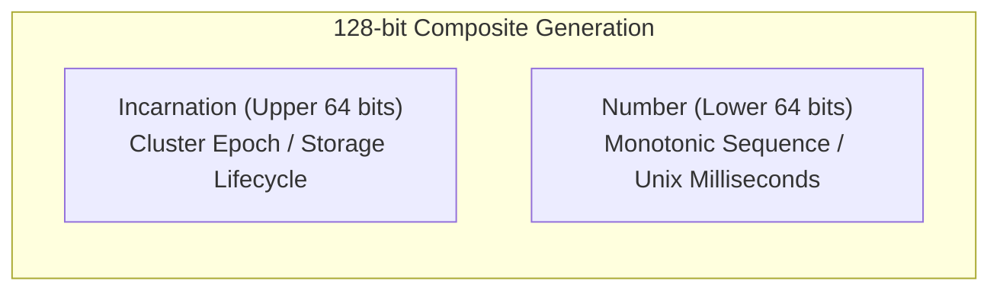
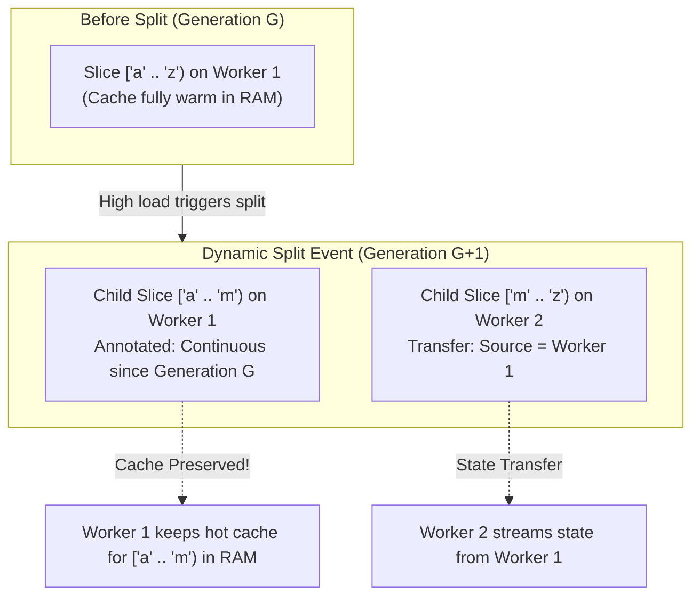
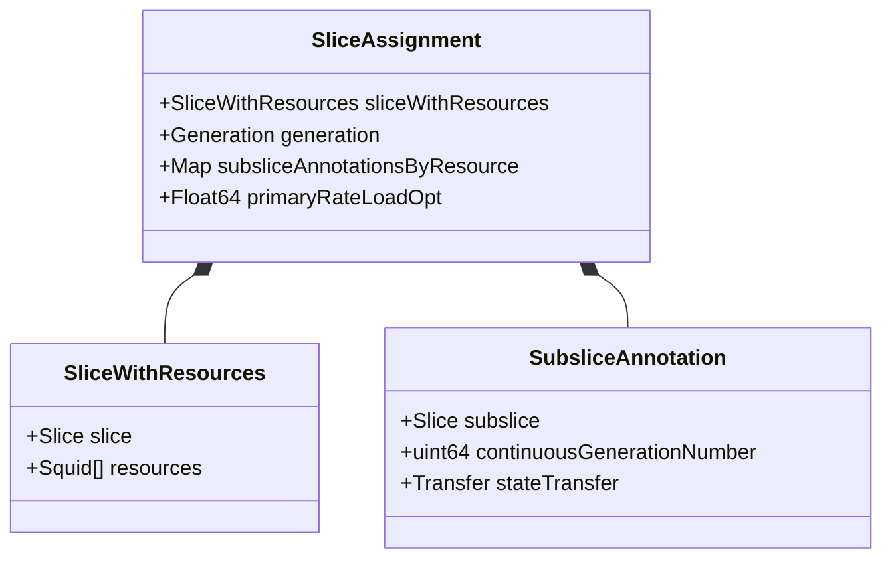
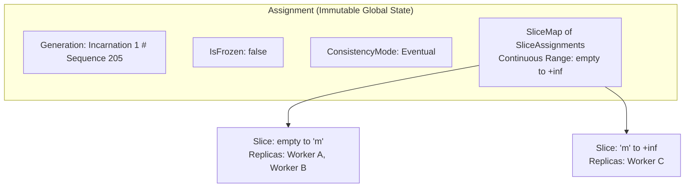
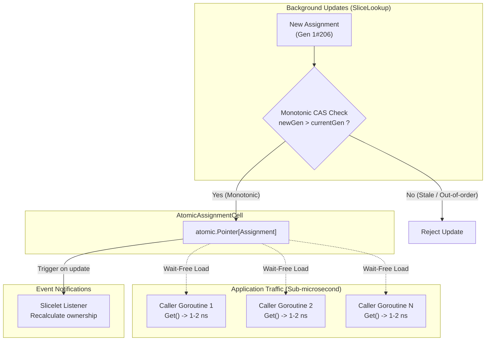
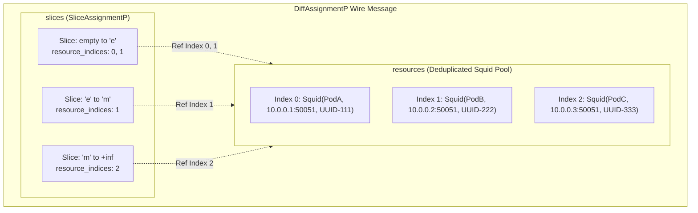

# Dicer Common Package (`pkg/common`)

The `common` package provides the core domain models, mathematical invariant validation, lock-free memory storage, and wire-format serialization logic for Dicer cluster state, partition assignments, and versioning.

---

## Table of Contents

1. [Version Management: `Incarnation` and `Generation`](#1-version-management-incarnation-and-generation)
2. [Subslice Tracking: `SubsliceAnnotation` and `Transfer`](#2-subslice-tracking-subsliceannotation-and-transfer)
3. [Partition Models: `SliceWithResources` and `SliceAssignment`](#3-partition-models-slicewithresources-and-sliceassignment)
4. [Global Cluster Map: `Assignment`](#4-global-cluster-map-assignment)
5. [Lock-Free Concurrency: `AtomicAssignmentCell`](#5-lock-free-concurrency-atomicassignmentcell)
6. [Protobuf Wire Protocol & Index Pooling](#6-protobuf-wire-protocol--index-pooling)

---

## 1. Version Management: `Incarnation` and `Generation`

Located in `generation.go`, these entities establish a composite 128-bit monotonically increasing version identifier that prevents version rollbacks and split-brain states across cluster lifecycles.



### `Incarnation`
- **Definition**: Represents the upper 64 bits of the cluster generation.
- **Purpose**: Tracks major storage or infrastructure lifecycles (e.g. etcd cluster re-initialization, disaster recovery). When a metadata store is wiped or recreated, simple incremental counters reset to 0. Bumping the `Incarnation` ensures that all surviving clients and servers immediately reject stale metadata from the previous cluster epoch.
- **Guardrail**: Enforces an upper bound guardrail (values must not exceed `5 << 48`) to protect against accidental bit overflow.

### `Generation`
- **Definition**: A composite 128-bit struct:
  - `Incarnation Incarnation`: Upper 64 bits.
  - `Number uint64`: Lower 64 bits.
- **Lexicographical Ordering**:
  ```mermaid
  flowchart TD
      Start(["Compare(Gen A, Gen B)"]) --> CheckInc{"A.Incarnation != B.Incarnation ?"}
      CheckInc -- "Yes" --> IncDiff["Return result based strictly on Incarnation"]
      CheckInc -- "No (Same Epoch)" --> NumDiff["Return result based on A.Number vs B.Number"]
  ```
- **Invariants**: An empty sentinel `EmptyGeneration` (incarnation 0, number 0) denotes uninitialized state. Any valid cluster assignment must carry a non-empty generation.

---

## 2. Subslice Tracking: `SubsliceAnnotation` and `Transfer`

Located in `subslice_annotation.go`, these entities solve the cache invalidation and cold start problem when partitions are dynamically split or merged.

### The Cold Start Problem & Solution



### `SubsliceAnnotation`
- **Definition**: An annotation attached to a slice assignment recording a sub-range that has remained continuously assigned to a specific worker.
- **Fields**:
  - `Subslice friend.Slice`: The continuous sub-range.
  - `ContinuousGenerationNumber uint64`: The earliest generation number from which continuous assignment began without interruption.
  - `StateTransfer *Transfer`: Optional pointer to the state source.
- **Benefit**: Allows the worker to verify continuous ownership, preserving hot cache in RAM and maintaining strict data consistency guarantees.

### `Transfer`
- **Definition**: Metadata indicating that data for a newly assigned partition should be fetched from another server pod incarnation.
- **Fields**:
  - `FromResource friend.Squid`: The source server pod incarnation that held the partition before the migration.

---

## 3. Partition Models: `SliceWithResources` and `SliceAssignment`

Located in `assignment.go`, these structs model individual slice allocations and strictly enforce mathematical invariants upon construction.



### Strict Invariants Enforced on Construction:
1. All annotated subslices must fit strictly inside the parent slice: `subslice.Low >= slice.Low` and `subslice.High <= slice.High`.
2. For any given resource, subslice annotations must be mutually disjoint and ordered ascending.
3. Continuous generation numbers on subslices must not exceed the slice generation: `ContinuousGenerationNumber <= Generation.Number`.
4. The slice generation must share the exact same `Incarnation` as the containing `Assignment`.
5. Slice generation must not exceed the parent assignment generation: `Slice.Generation <= Assignment.Generation`.
6. Measured load (`PrimaryRateLoadOpt`) must be a non-negative, finite number (no NaN or Infinity).

---

## 4. Global Cluster Map: `Assignment`

Located in `assignment.go`, `Assignment` represents the complete, immutable partitioning of the entire key space at a specific point in time.



### Core Methods
- `LookUp(key friend.SliceKey) SliceAssignment`: Binary searches the slice containing `key` in O(log N) time.
- `Resources() []friend.Squid`: Returns a deduplicated list of all active server pod incarnations present in the assignment.
- `IsAssignedKey(key friend.SliceKey, resource friend.Squid) bool`: Checks if a specific worker currently owns `key`.
- `GetAssignedSliceAssignments(resource friend.Squid) []SliceAssignment`: Retrieves all slice assignments allocated to `resource`.
- `GetAssignedSlices(resource friend.Squid) []friend.Slice`: Retrieves the slice boundaries allocated to `resource`.


---

## 5. Lock-Free Concurrency: `AtomicAssignmentCell`

Located in `atomic_assignment.go`, `AtomicAssignmentCell` provides high-throughput, wait-free concurrent reads and safe atomic updates.



- **Lock-Free Reads (`Get() *Assignment`)**:
  - Implemented via `atomic.Pointer[Assignment].Load()`.
  - Executes in 1 to 2 nanoseconds without acquiring locks or causing CPU stalls.
  - Readers can execute concurrently on arbitrary goroutines and CPU cores with zero lock contention.
- **Monotonic Atomic Updates (`Set(newAssignment *Assignment) bool`)**:
  - Uses an atomic Compare-And-Swap (CAS) loop.
  - Strictly enforces monotonicity: out-of-order network responses with older generations are safely rejected.
  - Automatically triggers registered listener callbacks.

---

## 6. Protobuf Wire Protocol & Index Pooling

Located in `proto_converter.go` (implementing wire schemas from `proto/dicer.proto`), this module handles bidirectional conversion between Go domain structs and network Protobuf payloads.

### Bandwidth Optimization via Resource Index Pooling

Instead of repeating full `SquidP` records (which contain lengthy UUID strings, network addresses, and timestamps) inside every single `SliceAssignmentP`, Dicer pools unique `SquidP` records in an array, and slice assignments reference them by 0-based integer indices:



This index pooling technique **shrinks wire payloads by over 90%** in large clusters with thousands of partitions.
