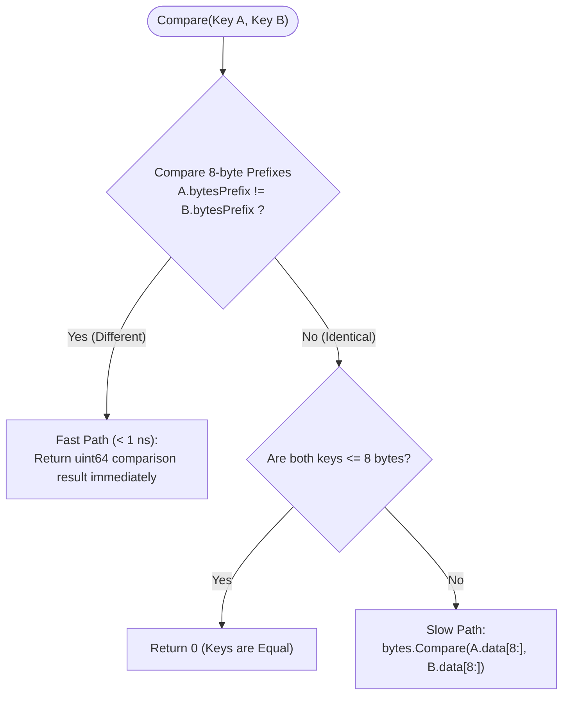
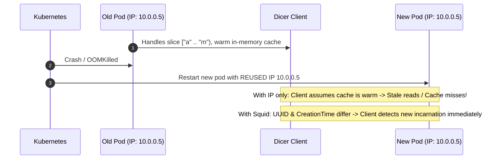
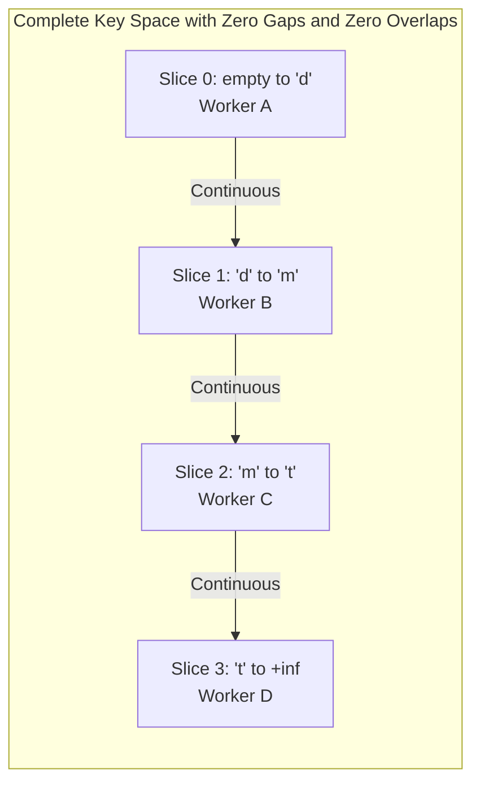
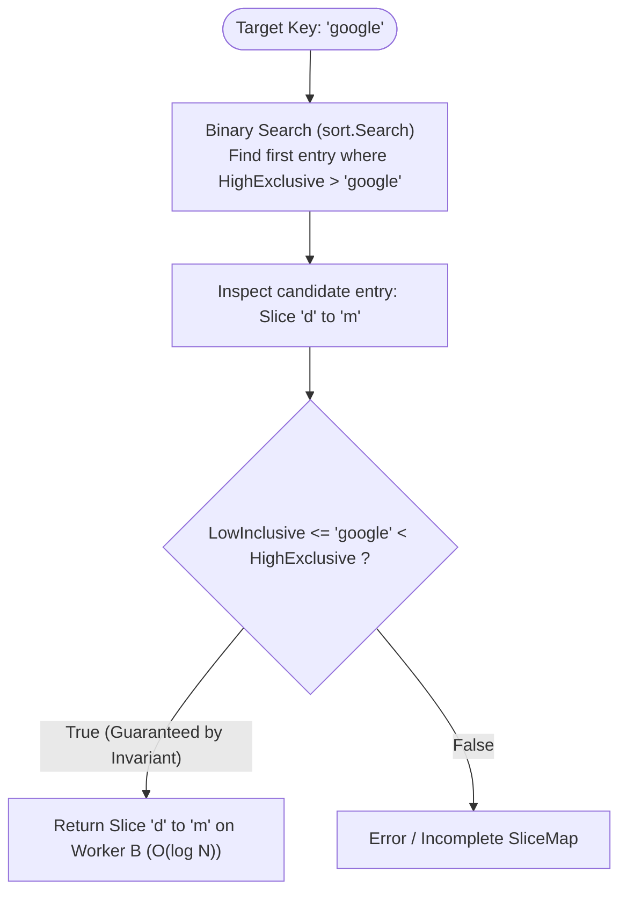
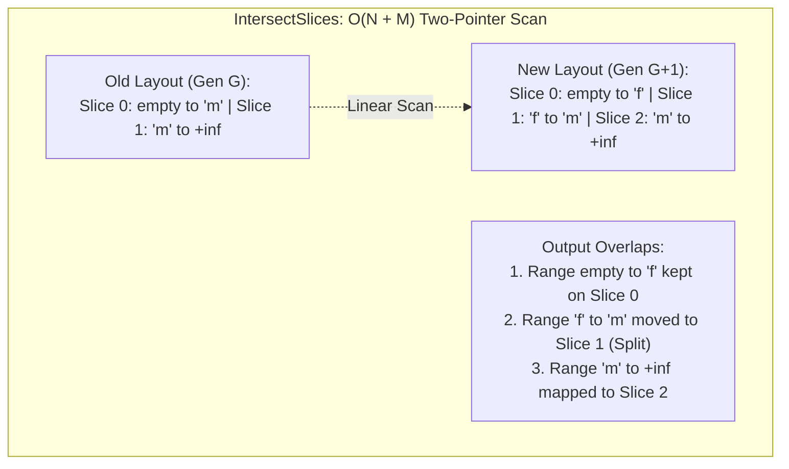
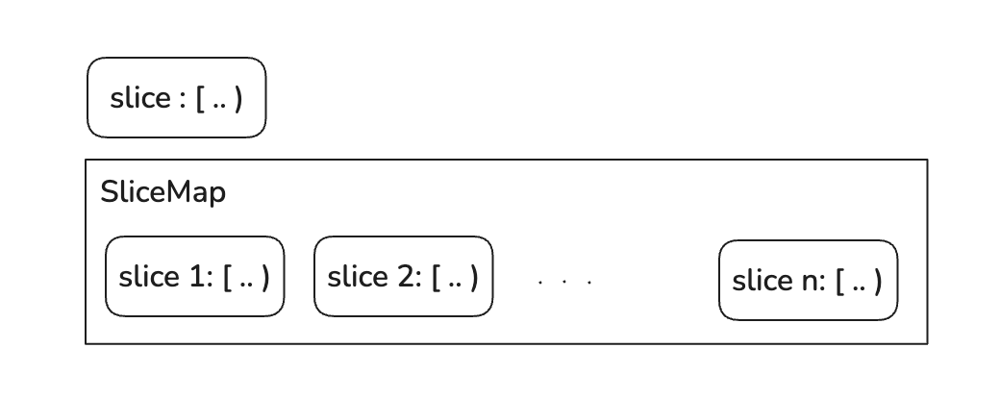

# Package `friend` - Core Slicing Data Structures

Package `friend` implements the mathematical foundation and fundamental data structures for range-based key slicing in Dicer. It is ported directly from Databricks Dicer's Scala codebase (`com.databricks.dicer.external.SliceKey`, `Slice`, and `com.databricks.dicer.friend.SliceMap`, `Squid`).

The primary purpose of this package is to provide **deterministic, gap-free, overlap-free, and lock-free O(log N) key-to-slice lookups in memory with sub-microsecond latency**.

---

## Architecture & Parity with Scala Dicer

| Scala Dicer Feature | Go Implementation (`pkg/friend`) | Parity Status |
| :--- | :--- | :---: |
| `SliceKey` (with 8-byte prefix optimization) | `friend.SliceKey` | 100% |
| `HighSliceKey` / `InfinitySliceKey` (`+∞`) | `friend.HighSliceKey` / `friend.InfinityKey` | 100% |
| `Slice` (`[Low .. High)`, `Contains`, `Intersection`) | `friend.Slice` | 100% |
| `SliceMap[T]` (Ordered disjoint partition wrapper) | `friend.SliceMap[T HasSlice]` | 100% |
| `findIndexInOrderedDisjointEntries` (Binary Search) | `friend.FindIndexInOrderedDisjointEntries` | 100% |
| `validateCompleteSlices` (Completeness validator) | `friend.ValidateCompleteSlices` | 100% |
| `intersectSlices` (2-pointer simultaneous scan) | `friend.IntersectSlices` | 100% |
| `coalesceSlices` (Adjacent slice merging) | `friend.CoalesceSlices` | 100% |
| `createFromOrderedDisjointEntries` & `GapEntry` | `friend.CreateFromOrderedDisjointEntries` | 100% |
| `Squid` (Slicelet Incarnation UniQUe ID) | `friend.Squid` | 100% |

---

## Detailed Components

### 1. `SliceKey`
A `SliceKey` represents an immutable byte sequence used as a routing identifier.

#### 8-Byte Prefix Optimization
When high-throughput routing lookups occur (millions of QPS), comparing byte slices byte-by-byte (`bytes.Compare`) creates CPU overhead and cache pollution.

To optimize this, `SliceKey` extracts its first 8 bytes into a Big-Endian `uint64` (`bytesPrefix`):
```go
type SliceKey struct {
    data        []byte
    bytesPrefix uint64
}
```



- **Fast Path:** `Compare(other)` first compares `k.bytesPrefix` with `other.bytesPrefix`. This is a single 64-bit integer comparison on CPU registers (< 1 ns). If they differ, the comparison finishes immediately without touching heap buffers.
- **Slow Path:** Full lexicographical comparison (`bytes.Compare`) is only triggered if the 8-byte prefixes are identical and keys are longer than 8 bytes.

---

### 2. `HighSliceKey` and Positive Infinity (+∞)
The key space in Dicer is open-ended. To represent the upper bound of a range without arbitrary "maximum string" sentinels (like `"zzzzzz..."` which fail when longer keys arrive), Dicer models the upper bound as:
- A finite `SliceKey`, or
- Positive Infinity (`InfinityKey` / `+∞`).

Any finite `SliceKey` is mathematically strictly less than `InfinityKey`.

---

### 3. `Slice`
A `Slice` models a half-open key interval: `[LowInclusive .. HighExclusive)`.
- Key `k` belongs to `Slice` if and only if `LowInclusive <= k < HighExclusive`.
- **Invariant:** `LowInclusive < HighExclusive`. Empty slices (`Low == High`) or inverted bounds are strictly prohibited.

#### Operations
- `Contains(key SliceKey) bool`: Checks if a key belongs to this slice.
- `ContainsSlice(other Slice) bool`: Checks if this slice completely encloses `other`.
- `Intersection(other Slice) (Slice, bool)`: Computes the overlapping interval between two slices.

---

### 4. `Squid` (Slicelet Incarnation UniQUe ID)
A `Squid` uniquely identifies a specific running incarnation of a server pod.

```go
type Squid struct {
    ResourceAddress    string    // Address used to route requests (e.g. "10.0.0.1:50051")
    CreationTimeMillis int64     // Creation time in milliseconds since Unix epoch
    ResourceUUID       string    // Globally unique ID (e.g. K8s Pod UID)
}
```

#### Why not just use IP or Pod Name?



In dynamic container environments (Kubernetes), Pod IP reuse is common. When a pod crashes and restarts, Kubernetes may assign it the exact same IP. 
Without `Squid`, clients and assigners would incorrectly assume the pod is the same continuous instance with pre-warmed cache. `Squid` combines `Address + CreationTime + UUID` to guarantee distinction between historical and new incarnations.

---

### 5. `SliceMap[T HasSlice]`
`SliceMap` manages an ordered, disjoint sequence of entries that completely partition the key space from `""` (`MinSliceKey`) to `+∞` (`InfinityKey`).



#### Completeness Invariants (`ValidateCompleteSlices`)
Before a `SliceMap` can be instantiated, its entries must strictly satisfy:
1. **Non-Empty:** Must contain at least one entry.
2. **Starts at Minimum:** The first slice must start at `MinSliceKey` (`""`).
3. **Continuous (No Gaps, No Overlaps):** For every index `i > 0`, `entries[i].LowInclusive == entries[i-1].HighExclusive`.
   - *Gaps* would leave keys unrouted (unassigned).
   - *Overlaps* would cause conflicting assignments across multiple servers.
4. **Ends at Infinity:** The last slice must terminate with `InfinityKey` (`+∞`).

#### LookUp Algorithm: O(log N) Binary Search



```go
func FindIndexInOrderedDisjointEntries[T HasSlice](entries []T, key SliceKey) int {
    // Finds the first entry whose HighExclusive > key
    idx := sort.Search(len(entries), func(i int) bool {
        return entries[i].GetSlice().HighExclusive.CompareWithKey(key) > 0
    })
    if idx < len(entries) && entries[idx].GetSlice().LowInclusive.Compare(key) <= 0 {
        return idx
    }
    return -1
}
```

Due to the completeness invariant, this lookup is guaranteed to locate the exact containing slice in `O(log N)` without any chance of missing.

---

### 6. Advanced Slicing Operations

#### `IntersectSlices(left, right)`
When the Assigner rebalances or splits keys (e.g., transitioning from `Generation G` to `Generation G+1`), it compares the old slice map with the new slice map to identify how slices were redistributed.
`IntersectSlices` uses a **two-pointer simultaneous scan** (`leftIt`, `rightIt`) from `""` to `+∞` in **O(N + M)** linear time.



#### `CoalesceSlices(sliceMap, equalVal, withSlice)`
Merges contiguous adjacent slices that map to equivalent values/destinations.
- Example: `[A .. B) -> Squid1` and `[B .. C) -> Squid1` are coalesced into `[A .. C) -> Squid1`.

#### `CreateFromOrderedDisjointEntries(entries)`
Accepts an incomplete list of ordered disjoint slices, automatically detects missing ranges, fills them with unassigned `GapEntry` instances, and constructs a complete `SliceMap`.

---

## Performance Benchmark

Running on Apple Silicon over an in-memory map of 500 disjoint slices:

```bash
$ go test -bench=. ./pkg/friend
BenchmarkLookUp-8   5830296   196.7 ns/op
```

- Each binary search lookup takes **~196 nanoseconds**.
- Capable of sustaining over **5,000,000 lookups/second per CPU core** in RAM.

